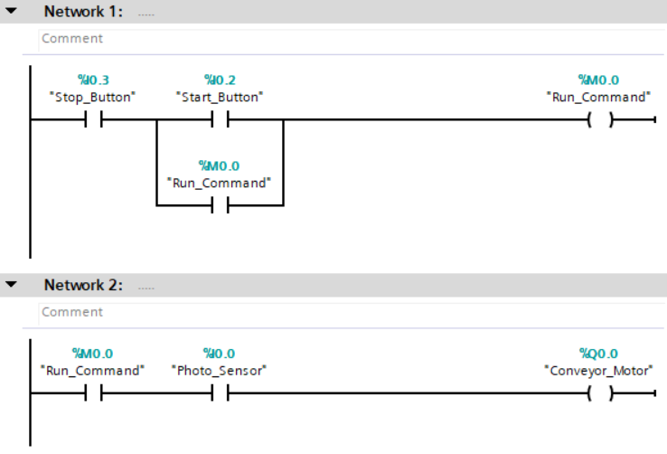
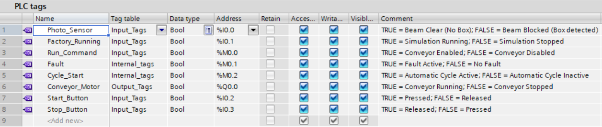
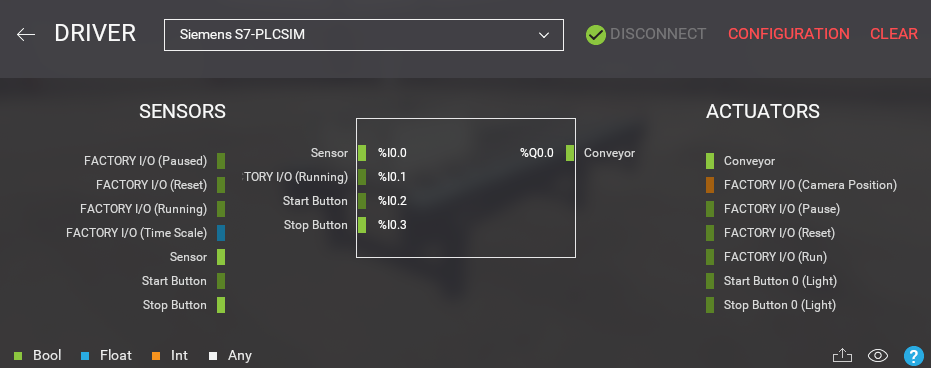

# Project 01 - From A to B
  


Basic conveyor control using Siemens TIA Portal, Factory I/O and PLCSIM.

## Overview

Developed a basic conveyor control system using **Siemens TIA Portal V16**, **S7-PLCSIM**, and **Factory I/O**.

The conveyor transports a box until it blocks the photoelectric sensor, causing the conveyor motor to stop.

This project demonstrates the implementation of a classic **Start/Stop seal-in circuit (self-holding circuit)** together with Factory I/O simulation.

---

## Features

- Start/Stop Pushbutton Control
- Seal-in (Self-holding) Circuit
- Conveyor Motor Control
- Photoelectric Sensor Detection
- Factory I/O Integration
- Siemens S7-1200 PLC Simulation

---

## Software

| Software | Version |
|----------|---------|
| Siemens TIA Portal | V16 Update 8 |
| S7-PLCSIM | V16 Update 4 |
| Factory I/O | 2.5.6 |

---

## PLC Hardware

**CPU:** Siemens S7-1200 CPU1211C DC/DC/DC

---

## I/O Mapping

| Tag | Address | Description |
|------|---------|-------------|
| Photo_Sensor | %I0.0 | Photoelectric Sensor |
| Factory_Running | %I0.1 | Factory I/O Running Status |
| Start_Button | %I0.2 | Start Pushbutton |
| Stop_Button | %I0.3 | Stop Pushbutton |
| Conveyor_Motor | %Q0.0 | Conveyor Output |
| Run_Command | %M0.0 | Internal Seal-in Bit |

---

## Ladder Logic

### Network 1 — Start / Stop Seal-in Circuit

Implements a self-holding (seal-in) circuit using memory bit **%M0.0**.

### Network 2 — Conveyor Motor Control

Runs the conveyor while the Run_Command is active and the photo sensor beam is clear.

---

## Project Structure

```
Project-01-From-A-to-B
│
├── FactoryIO
│   ├── From-A-to-B.factoryio
│   └── driver-config.png
│
├── Images
│   ├── scene.png
│   ├── ladder.png
│   ├── plc-tags.png
│   ├── factoryio-driver.png
│   └── ...
│
└── README.md
```

---

## Screenshots

### Ladder Logic



### PLC Tags



### Factory I/O Driver Configuration



---

## Demonstration

The demonstration video, archived TIA Portal project (.zap16), and Factory I/O scene are available in the GitHub Release.

▶ [Project 01 Release](https://github.com/nienyuwu/TIA-Portal-Portfolio/releases/tag/Project01-v1.0)


---

## Lessons Learned

- Factory I/O **Photo Sensor** uses inverted logic:
  - TRUE = Beam Clear
  - FALSE = Box Detected
- Factory I/O **Stop Button** is active-low:
  - TRUE = Released
  - FALSE = Pressed
- A **seal-in (self-holding)** circuit was implemented using internal memory bit **%M0.0**.
- The official Factory I/O Siemens template simplifies communication with S7-PLCSIM.
- TIA Portal projects can be conveniently distributed using **.zap16** archived projects.

---

## PLC Concepts

- PLC Programming
- Ladder Logic (LAD)
- Digital Inputs
- Digital Outputs
- Normally Open Contacts
- Normally Closed Contacts
- Internal Memory Bits (M Area)
- Seal-in (Self-holding) Circuit
- Photoelectric Sensors
- Conveyor Control
- PLC Simulation
- Industrial Automation

---

## Author

Created by **Nien-Yu Wu**

Automation Engineering Portfolio

GitHub: <https://github.com/nienyuwu>
