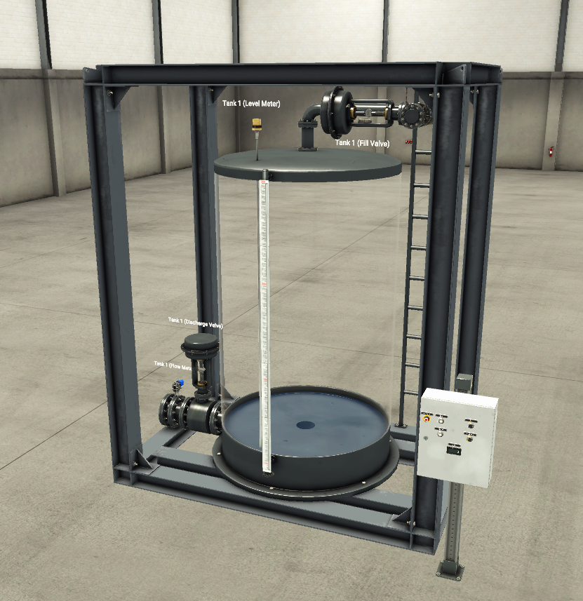
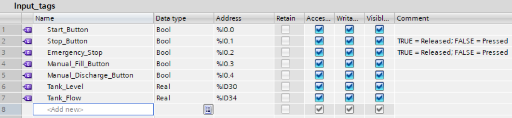
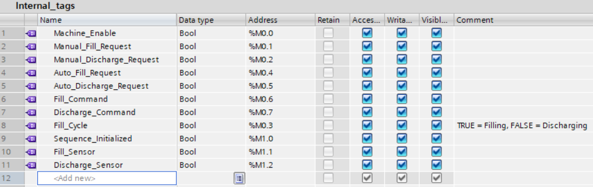
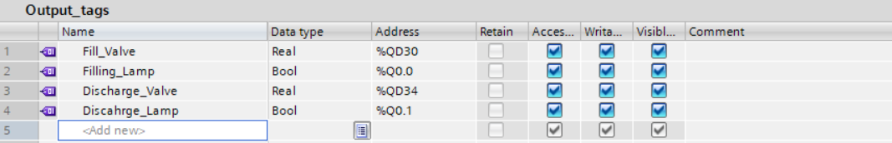
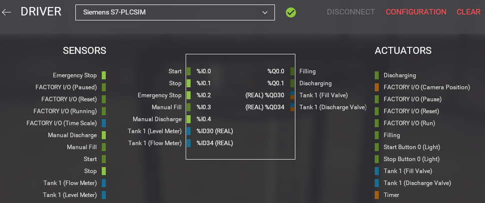

# Project 02 - Tank Filling




Automatic tank filling and discharge control using Siemens TIA Portal, Factory I/O and PLCSIM.

---

## Overview

Developed an automatic tank filling system using **Siemens TIA Portal V16**, **S7-PLCSIM**, and **Factory I/O**.

The PLC automatically fills and discharges an analog tank by monitoring the tank level, controlling analog valves, and managing the filling sequence with timers.

This project demonstrates analog signal processing, automatic sequence control, manual override, analog output control, and a layered PLC software architecture using Ladder Logic.

---

## Features

- Automatic Tank Filling
- Automatic Tank Discharge
- Analog Tank Level Processing
- Analog Valve Control
- Manual Fill / Discharge Override
- TON Timer Control
- Automatic Sequence Control
- Factory I/O Integration
- Siemens S7-1200 PLC Simulation

---

## Software

| Software | Version |
|----------|---------|
| Siemens TIA Portal | V16 Update 8 |
| S7-PLCSIM | V16 Update 4 |
| Factory I/O | 2.5.6 |

---

## PLC Hardware

**CPU:** Siemens S7-1200 CPU1211C DC/DC/DC

---

## I/O Mapping

### Inputs

| Tag | Address | Description |
|------|---------|-------------|
| Tank_Level | %ID30 | Analog Tank Level |
| Tank_Flow | %ID34 | Analog Tank Flow |
| Start_Button | %I0.0 | Start Pushbutton |
| Stop_Button | %I0.1 | Stop Pushbutton |
| Emergency_Stop | %I0.2 | Emergency Stop |
| Manual_Fill_Button | %I0.3 | Manual Fill |
| Manual_Discharge_Button | %I0.4 | Manual Discharge |

### Outputs

| Tag | Address | Description |
|------|---------|-------------|
| Fill_Valve | %QD30 | Analog Fill Valve |
| Discharge_Valve | %QD34 | Analog Discharge Valve |

---

## Ladder Logic

The PLC program is organized into several functional modules to improve readability, scalability, and maintenance.

| Module | Function |
|--------|----------|
| Signal Processing | Converts analog tank level into digital control states |
| Machine Enable | Start / Stop and machine enable logic |
| Manual Control | Processes manual fill and discharge requests |
| Automatic Sequence | Controls automatic filling and discharge cycles |
| Command Merge | Combines manual and automatic commands with manual priority |
| Output Conversion | Converts digital commands into analog valve outputs |

---

## Project Structure

```text
Project-02-Tank-Filling
│
├── FactoryIO
│   ├── Tank-Filling.factoryio
│   └── driver-config.png
│
├── Images
│   ├── scene.png
│   ├── architecture.drawio
│   ├── architecture.svg
│   ├── plc-input-tags.png
│   ├── plc-internal-tags.png
│   ├── plc-output-tags.png
│   ├── factoryio-driver.png
│   └── ...
│
└── README.md
```

---

## Screenshots

### Layered PLC Architecture


### PLC Tags

#### Input Tags



#### Internal Tags



#### Output Tags



### Factory I/O Driver Configuration



---

## Demonstration

The demonstration video, archived TIA Portal project (.zap16), and Factory I/O scene are available in the GitHub Release.

▶ [Project 02 Release](https://github.com/nienyuwu/TIA-Portal-Portfolio/releases/tag/project-02-v1.0.0)


---

## Lessons Learned

- Factory I/O Analog Tank uses **REAL values ranging from 0.0 to 10.0**.
- Analog valves are controlled using **REAL output values between 0.0 (closed) and 10.0 (fully open)**.
- Analog signals can be converted into digital states for reliable sequence control.
- Automatic filling and discharge can be implemented using state-based logic together with TON timers.
- Manual commands can safely override automatic sequences through command merging.
- Separating signal processing, control logic, and output conversion improves PLC program readability and maintainability.
- A layered PLC architecture makes the control program easier to understand, maintain, and extend.

---

## PLC Concepts

- PLC Programming
- Ladder Logic (LAD)
- Analog Inputs
- Analog Outputs
- Analog Signal Processing
- TON Timers
- Set / Reset Instructions
- State-based Sequence Control
- Manual Override
- Analog Valve Control
- Factory I/O Integration
- PLC Simulation
- Industrial Automation

---

## Author

Created by **Nien-Yu Wu**

Automation Engineering Portfolio

GitHub: <https://github.com/nienyuwu>