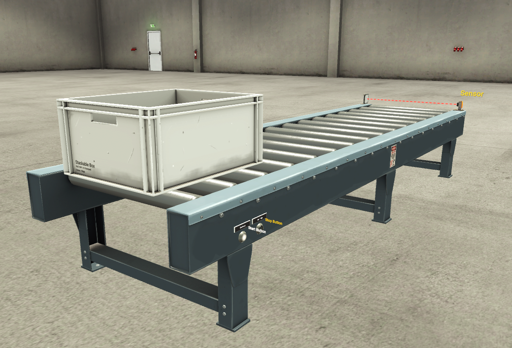

# Project 01 - From A to B


## Overview

Developed a basic conveyor control system using **Siemens TIA Portal V16**, **S7-PLCSIM**, and **Factory I/O**.

The conveyor transports a box until it reaches a photoelectric sensor, where the conveyor automatically stops.

This project demonstrates the implementation of a classic **Start/Stop seal-in circuit (self-holding circuit)** together with Factory I/O simulation.

---

## Features

- Start Button
- Stop Button
- Seal-in (Self-holding) Circuit
- Conveyor Motor Control
- Photoelectric Sensor Detection
- Factory I/O Integration
- Siemens S7-1200 PLC Simulation

---

## Software

| Software | Version |
|----------|---------|
| Siemens TIA Portal | V16 Update 8 |
| S7-PLCSIM | V16 Update 4 |
| Factory I/O | 2.5.6 |

---

## PLC Hardware

**CPU:** Siemens S7-1200 CPU1211C DC/DC/DC

---

## I/O Mapping

| Signal | Address |
|---------|---------|
| Photo Sensor | %I0.0 |
| Factory Running | %I0.1 |
| Start Button | %I0.2 |
| Stop Button | %I0.3 |
| Conveyor Motor | %Q0.0 |
| Run Command | %M0.0 |

---

## Ladder Logic

### Network 1
Start / Stop Seal-in Circuit

### Network 2
Conveyor Motor Control

---

## Project Structure

```
Project_01_From_A_to_B
│
├── Docs/
├── FactoryIO/
├── Images/
├── Videos/
├── TIA/
└── README.md
```

---

## Screenshots

### Factory I/O Scene



### Ladder Logic


### PLC Tags


### Factory I/O Driver Configuration


---

## Demonstration

Demo video:

`Videos/Project01.mp4`

---

## Lessons Learned

- Factory I/O **Photo Sensor** uses inverted logic:
  - TRUE = Beam Clear
  - FALSE = Box Detected
- Factory I/O **Stop Button** is active-low:
  - TRUE = Released
  - FALSE = Pressed
- A **seal-in (self-holding)** circuit was implemented using internal memory bit **%M0.0**.
- The official Factory I/O Siemens template simplifies communication with S7-PLCSIM.
- TIA Portal projects can be shared conveniently using **.zap16** archived projects.

---

## PLC Concepts

- Digital Inputs
- Digital Outputs
- Internal Memory Bits
- Normally Open Contacts
- Normally Closed Contacts
- Seal-in (Self-holding) Circuit
- Photoelectric Sensors
- Conveyor Control
- PLC Simulation

---

## Author

Created by **Nien-Yu Wu**

Automation Engineering Portfolio
